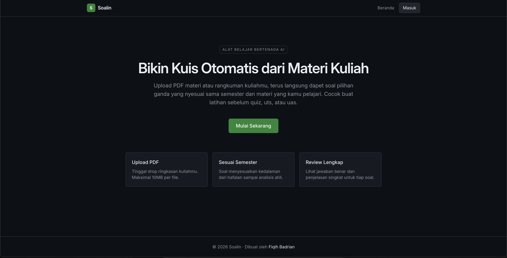
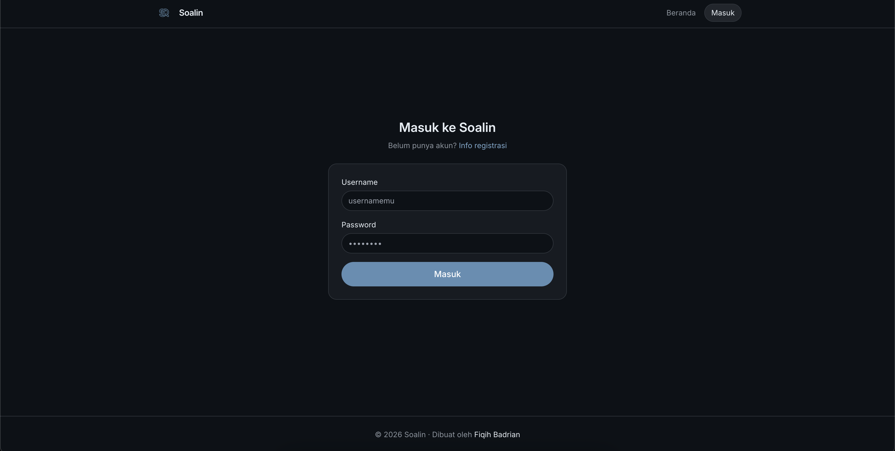
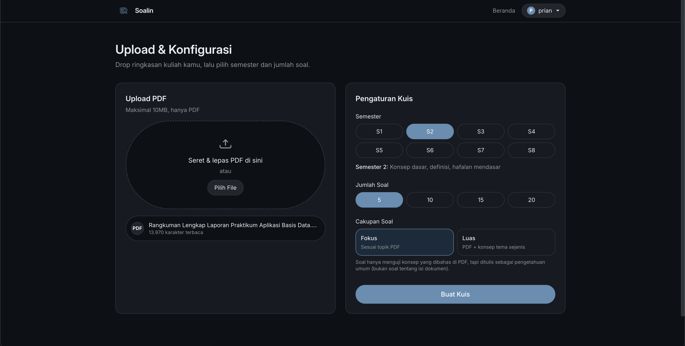

# Soalin - Project Preview

Preview aplikasi kuis otomatis berbasis AI dari materi PDF.

Live demo: https://soalin.fiqihbadrian.my.id/

Dokumen ini dibuat khusus untuk kebutuhan preview project. Repository ini tidak menyertakan source code publik.

## Tentang Project

Soalin membantu pengguna belajar lebih cepat dengan cara mengubah materi kuliah (PDF) menjadi kuis pilihan ganda secara otomatis.

Pengguna cukup:
1. Login.
2. Upload PDF materi/rangkuman.
3. Pilih tingkat semester dan jumlah soal.
4. Kerjakan kuis dan lihat hasil serta pembahasan.

## Fitur Utama

- Generate kuis otomatis dari PDF menggunakan AI.
- Pengaturan tingkat kesulitan berdasarkan semester (1-8).
- Opsi jumlah soal: 5, 10, 15, atau 20.
- Soal pilihan ganda 4 opsi (A-D) dengan pembahasan tiap soal.
- Mode sumber soal:
	- Strict mode: fokus hanya pada topik dari PDF.
	- Supplement mode: boleh memperluas konsep umum yang masih satu tema.
- Upload PDF dengan validasi file (hanya PDF, maksimal 10MB).
- Hasil kuis menampilkan skor, persentase, dan review jawaban.
- Progress kuis tersimpan di browser, jadi bisa lanjut mengerjakan.

## Sistem Akses

- Halaman kuis dilindungi login.
- Registrasi akun tidak dibuka publik (akun dibuat manual oleh admin).
- Tersedia panel admin tersembunyi untuk:
	- Membuat user baru.
	- Melihat daftar user.
	- Menghapus user.

## Alur Penggunaan

1. Masuk melalui halaman login.
2. Upload file PDF materi.
3. Sistem mengekstrak teks dari PDF.
4. Pilih semester, jumlah soal, dan mode generate.
5. AI membuat kuis sesuai konfigurasi.
6. Kerjakan kuis per soal sampai selesai.
7. Lihat nilai akhir dan review pembahasan.

## Teknologi yang Digunakan

- Next.js + TypeScript
- Tailwind CSS
- OpenRouter (LLM API)
- pdf-parse (ekstraksi teks PDF)
- Supabase (data user dan sesi hasil)
- JWT cookie auth + bcrypt
- Zustand (state management)

## Catatan

- PDF hasil scan gambar tanpa OCR biasanya tidak bisa diekstrak dengan baik.
- Kualitas dan kecepatan generate soal mengikuti model AI yang digunakan.

## Kontak

Project by Fiqih Badrian

- Website: https://fiqihbadrian.my.id
- Demo app: https://soalin.fiqihbadrian.my.id/

## Live Preview (Gambar)

---

*****Last updated: May 25, 2026 at 07:50*
